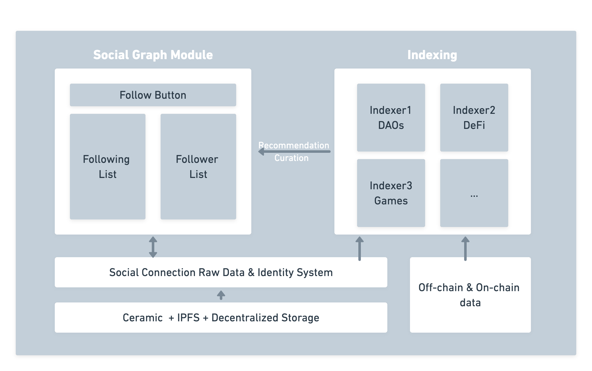
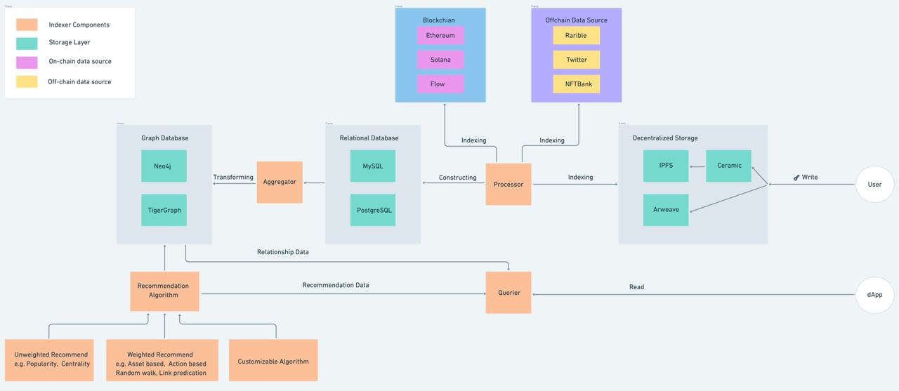

# CyberConnect Indexer

## CyberConnect Indexer at a High Level

We introduce how to mutate(follow and unfollow) a connection status between addresses in [JavaScript SDK](./installation) and [CyberConnect Button](./follow_button) sections. In this section, we will guide you how to query connection data and get potential relationship recommendations from CyberConnect Indexer.

CyberConnect Indexer collects on-chain data from IPFS and blockchain networks, and off-chain data from various platforms. Then, it aggregates, transforms, and stores raw data into graph databases. After deployment, the Indexer can perform address identity curation and provide connection recommendations to Social Graph Module in user-end applications.

## CyberConnect Indexer Architecture

The CyberConnect Indexer can be divided into four parts: Processor, Aggregator, Recommender, and Querier. Each of them processes data sequentially in a pipelined fashion and In the following, we introduce each part in this order.

The Processor aims to index raw data from the IPFS network, blockchain networks like Ethereum and Solana, and fetch off-chain data from platforms like Rarible, Twitter, NFTBank, etc. The Processor will store fetched and indexed data in relational databases like MySQL, PostgreSQL.

The Aggregator reads data written by the Processor in relational databases, transforms and stores them into graph databases like Neo4j, TigerGraph, ready for Recommender and Querier to use.

The Recommender adopts both unweighted (by the popularity in the whole network, etc.) and weighted (asset-based, action-based, etc.) recommendation algorithms to analyze potential relationships and make recommendations. It also supports customizable recommendation algorithms based on the host’s needs.

The Querier serves three main purposes: providing identity data, providing relationship data, and connection recommendations. It retrieves data from graph databases, gets recommendation results from the Recommender, and returns data in the way requested.

## Data Retrieval

CyberConnect Indexer uses GraphQL as the query language for data retrieval. You can query address identity information and get recommendations through Indexer’s GraphQL endpoint. In the next page, we will start with [getting an address’ identity](./get_identity).
