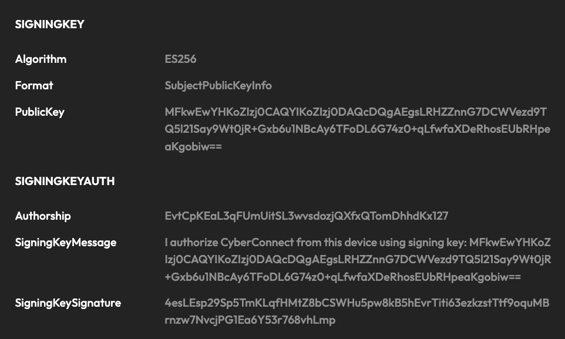

# Proof of Connection

CyberConnect protocol commits to providing a secure and user-friendly process for generating connections between addresses.

In order to provide **data verifiability** and **higher security**, CyberConnect adopts a standardized signing key generation and storage, connection proof generation, and verification scheme, which is called Proof of Connection (PoC).

In this page, we use an example from [CyberConnect Solana Page](http://sol.cyberconnect.me) to describe the whole process in three parts: key generation, proof generation, and proof verification. The following picture is an example of a complete proof.


## Key Generation

When a user is going to mutate a connection status (e.g. connect to someone), and there is no existing signing key or all signing keys existing have expired, the client-side application will initiate the Key Generation process.

An ES256 key pair will be randomly generated from the client side. In order to identify the user, the signing key will be authorized through the MetaMask popup. In the example, the data of “SIGNINGKEY” is created in this step.



The public key of the signing key pair will be uploaded and stored in the CyberConnect Indexer with “SIGNINGKEYAUTH” info. This is for the indexer to examine that the message sender is the address user. The private key of the signing key pair will be safely stored in local LevelDB after encryption.

## Proof Generation

After generating a valid key, the process of generating a proof begins.

The mutation operation of the user can be parsed as a format of JSON, for example:

```json
{
  "from": "0x8ddD03b89116ba89E28Ef703fe037fF77451e38E",
  "to": "0x6eB98FC865C30Be5e8c10902CA84De06665573C0",
  "operation": "follow",
  "namespace": "CyberConnect",
  "timestamp": "1642414321"
}
```

We get a digest by doing hash operation:

$$
Digest = Hash(OperationRawData)
$$

Then, upload JSON blob, digest, and public key of signing key pair to the CyberConnect Indexer.


After receiving the struct, the indexer validates the signing key, digest, timestamp, and operation that the user wants to execute.

If all inspections pass, a proof will be generated to authenticate this operation.

## Proof Verification

Any proof from CyberConnect Proof of Connection can be validated by any third party. The verification of a proof takes three steps:

### Step 1 - Check SIGNINGKEYAUTH

To validate a proof, first of all, you need to ensure the signing key has been authorized by the user’s wallet. You should validate if the signature in the proof matches the signature calculated on your end based on the user’s address and SigningKeyMessage.

$$
Input: calculatedSigningKeySig(userAddr, signingKeyMessage), signingKeySig
$$

$$
Check: calculatedSigningKeySig == signingKeySig
$$

### Step 2 - Check Operation Signature

If the result from Step 1 is correct, then, use the signing key provided in the proof, check whether the signature calculated by you matches the one in the proof.

$$
Input: calculatedSignature(signingKey, OperationRawData), signature
$$

$$
Check: calculatedSignature == signature
$$

### Step 3 - Check OperationRawData

Finally, if the first two steps pass, check if the operation described in the OperationRawData matches the operation that you are validating.

$$
Input: \newline providedOperation\ \{name, from, to, namespace, network\}, \newline validatingOperation\ \{name, from, to, namespace, network\}
$$

$$
Check: providedOperation\ and\ validatingOperation\ matches\ in\ each\ field
$$

If all three checks are passed, the operation is authenticated.
