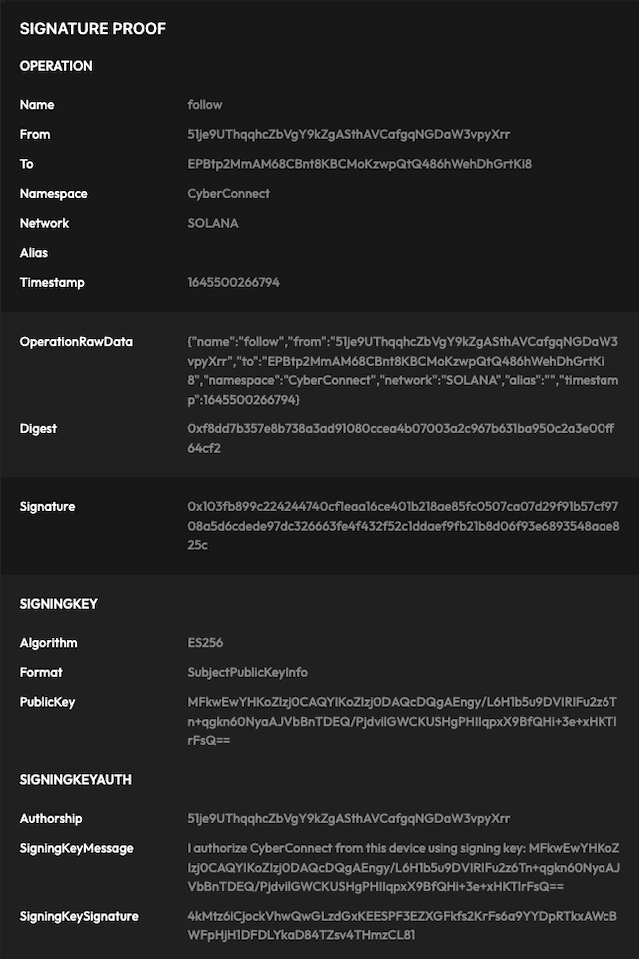

# Proof of Connection

In order to provide **data verifiability** and **higher security**, CyberConnect adopts a standardized signing key generation and storage, connection proof generation and verification scheme. We call this scheme as Proof of Connection(PoC).
In this page, we will in describe the design and processes of proof generation and verification. In the end, there will be an example for you.

## PoC Design

CyberConnect protocol commits to providing a secure and user-friendly process for generating connections between addresses.

For the first time use, a signing key will be randomly generated from the client side, authorized through Metamask popup to identify the user and complete signing. Then, the public key of this signing key will be uploaded to the CyberConnect Indexer for storage and verification.

By following this procedure, the number of times the primary key used is reduced to a minimum, and hence to improve the security.

The complete process consists of three parts: Key Generation, Proof Generation and Proof Verificaiton.

## Key Generation

First of all, there are some definitions for the description below:

```
A = WalletAddress

SK = SigningKey

SKS = SigningKeySiganture

SKM = SigningKeyMessage

S = Signature

P = Proof

B = content json blob

D = content json blob digest
```

### Frontend Workflow

**The following steps happen on the frontend**

**Step 1 -** When a user meets the first and one of the second and third requirement below, a signing key pair **SK** will be generated:

1. the user is going to have some mutations (e.g., follow/unfollow/setAlias)
2. local storage has no existed signing key
3. all existed signing keys expired

**Step 2 -** A signing message **SKM** which also includes **SK** will be constructed:

```javascript
"signingKeyMessage":"I authorize publishing on mirror.xyz from this device using:\n{\"crv\":\"P-256\",\"ext\":true,\"key_ops\":[\"verify\"],\"kty\":\"EC\",\"x\":\"srzvlrXFj1r0w7kyIUj-eppIodL1xwZfUC_RFweIzqw\",\"y\":\"Q9EEahZLd7SUrmIdKP5245D6IoD8XAtb-_Iw7xDp-DA\"}"
```

**Step 3 -** MetaMask pops up to ask user with address **A** to sign the **SKM** to produce signature **SKS**.

**Step 4 -** Register **SK** to **A**'s keychain by callling backend - **registerKey/auth(A, SKM, SKS)**

**Step 5 -** The Application stores _SK_ private key into local storage if previous step gets a successful response

**The following steps happen on the indexer backend**

**Step 1 -** The indexer gets **SK** public key from **SKM**

**Step 2 -** The indexer verifies if **SKS** is valid

**Step 3 -** The indexer adds **SK** and **SKM** to _A’s keychain_ with a expiration time

## Proof Generation

**The following steps happen on the frontend**

**Step 1 -** The frontend constructs a JSON blob **B** to describe the operation:

```json
{
  "from": "0x8ddD03b89116ba89E28Ef703fe037fF77451e38E",
  "to": "0x6eB98FC865C30Be5e8c10902CA84De06665573C0",
  "operation": "follow",
  "namespace": "CyberConnect",
  "timestampe": "1642414321"
}
```

**Step 2 -** Hash **B** to get a digest **D**

```json
{
  "digest": "h6DcpvucQHbAWVlGQ_TdG3XqmURRt9keHC1KsAJ1lvM"
}
```

**Step 3 -** Use **SK** to sign **D** and send signature **S** to backend by calling the relative mutation endpoint (e.g., **follow/unfollow(A, SK, S, B, D)**)

**The following steps happen on the indexer backend**

**Step 1 -** Verify that **SK** is not expired and belongs to **A**

**Step 2 -** Verify **B→D** mapping and **S** is valid

**Step 3 -** Verify operation from **B** is valid (e.g. timestamp > lastModifiedAt) against MySQL database.

**Step 4 -** Construct a proof string **P = (A, SK, SKM, B, D, S)**

For follow and unfollow, the format would be:

```
{
  "name": "follow"/"unfollow" string
  "from": string
  "to": string
  "namespace": string
  "network": "ETH"/"SOLANA" string
  "alias": ""
  "timestamp": int
}
```

For example,

```json
{
  "operation": "{\"name\":\"follow\",\"from\":\"0xbd358966445e1089e3AdD528561719452fB78198\",\"to\":\"0xb36b8Df2A1164c9f6bC34C7802046F3695426CdB\",\"namespace\":\"CyberConnect\",\"network\":\"ETH\",\"alias\":\"\",\"timestamp\":1642670883362}",
  "digest": "0x3df02d319f0ea9e250e791716f7a4e34ecc21a665005939a6d71255f4f60c8e4",
  "signature": "0xa26b62c3fc1a8a5345e100b4157e22ffadb8f9e34a49131bae93cb41ca830602417651d30d0337ef12706404295a552478a19829d5ca06606cd1334bb4b8158b",
  "signingKey": {
    "publicKey": "MFkwEwYHKoZIzj0CAQYIKoZIzj0DAQcDQgAEGYincB66BCRjXptu6+QrFVCMV/sklFrH/lT3OBepjItjlf61zUfYok/5oGdPWbqD1/vq9xaI9TzKP8fB5fh2hw==",
    "format": "SubjectPublicKeyInfo",
    "algorithm": "ES256"
  },
  "signingKeyAuth": {
    "authorship": "0xbd358966445e1089e3add528561719452fb78198",
    "signingKeySignature": "0xe9ec44db013cea687d2c451c3d8654291266c533a45b9d8a0614e458ffa8dd5e34f388b6511f324657e8d4ccf4c3542fc877d9d3fd3cc384d80450e22617a0041b",
    "signingKeyMessage": "I authorize CyberConnect from this device using signing key:\nMFkwEwYHKoZIzj0CAQYIKoZIzj0DAQcDQgAEGYincB66BCRjXptu6+QrFVCMV/sklFrH/lT3OBepjItjlf61zUfYok/5oGdPWbqD1/vq9xaI9TzKP8fB5fh2hw=="
  }
}
```

**Step 5 -** Store or update Proof **P** to user’s connection table.

## Proof Verification

While the key generation and proof generation steps happen on the user's frontend and the CyberConnect Indexer backend, proof can be retrieved through [Connection](./get_connection) API and is verifiable by any third party.

After a proof is retrived, the verification should contain three steps:

**Step 1 -** Verify **SK** is authorized by the user. In specific, examine **signingKeySignature** in **signingKeyAuth**.

**Step 2 -** Verify **operation** is signed by the signing key. In specific, examine **digest**.

**Step 3 -** Verify **operation** matches the connection that you are verifying with. In specific, examine **operation**.

## Example

[CyberConnect Official Solana Webpage](https://sol.cyberconnect.me/) provides an implementation of PoC and a visble display of proof data. Connect to your Solana wallet and follow someone on the site. You can see a your connection proofs like this image:


